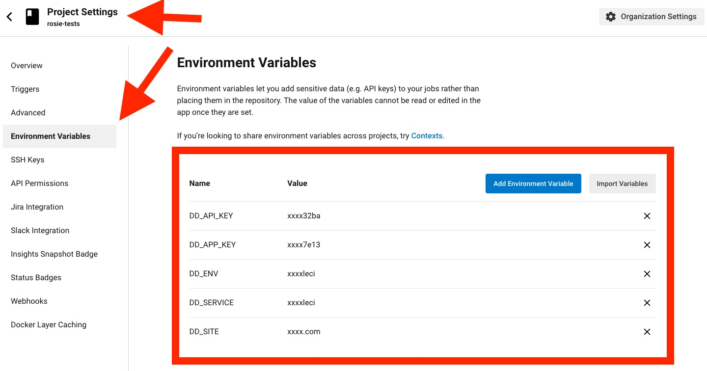

# Orb Template


[](https://circleci.com/gh/juli1/rosie-orb) [](https://circleci.com/developer/orbs/orb/juli1/rosie-orb) [](https://raw.githubusercontent.com/juli1/rosie-orb/master/LICENSE) [](https://discuss.circleci.com/c/ecosystem/orbs)


This is the ORB for DataDog Static Analysis solution. Trigger a code analysis from CircleCI
and store the results in Datadog.

## Configuration


### Environment configuration

Add the following environment variables to your project:

 - `DD_APP_KEY`: Datadog application key
 - `DD_API_KEY`: Datadog API key
 - `DD_ENV`: Datadog environment to store the results
 - `DD_SERVICE`: Datadog corresponding service
 - `DD_SITE`: The site to use to use datadog. See [here](https://docs.datadoghq.com/getting_started/site/) for more information (the default is `datadoghq.com`) 




### ORB configuration

There is an example of configuration to trigger the ORB. The essential parts are:
 - checkout the code
 - call the Datadog static analyzer


```yaml
version: '2.1'
orbs:
  datadog-static-analysis: juli1/rosie-orb@dev:alpha
jobs:
  build:
    docker:
      - image: cimg/node:current
    steps:
      - checkout
      - datadog-static-analysis/analyze
workflows:
  main:
    jobs:
      - build
```


---

## Resources

[CircleCI Orb Registry Page](https://circleci.com/developer/orbs/orb/juli1/rosie-orb) - The official registry page of this orb for all versions, executors, commands, and jobs described.

[CircleCI Orb Docs](https://circleci.com/docs/orb-intro/#section=configuration) - Docs for using, creating, and publishing CircleCI Orbs.

### How to Contribute

We welcome [issues](https://github.com/juli1/rosie-orb/issues) to and [pull requests](https://github.com/juli1/rosie-orb/pulls) against this repository!

### How to Publish An Update
1. Merge pull requests with desired changes to the main branch.
    - For the best experience, squash-and-merge and use [Conventional Commit Messages](https://conventionalcommits.org/).
2. Find the current version of the orb.
    - You can run `circleci orb info juli1/rosie-orb | grep "Latest"` to see the current version.
3. Create a [new Release](https://github.com/juli1/rosie-orb/releases/new) on GitHub.
    - Click "Choose a tag" and _create_ a new [semantically versioned](http://semver.org/) tag. (ex: v1.0.0)
      - We will have an opportunity to change this before we publish if needed after the next step.
4.  Click _"+ Auto-generate release notes"_.
    - This will create a summary of all of the merged pull requests since the previous release.
    - If you have used _[Conventional Commit Messages](https://conventionalcommits.org/)_ it will be easy to determine what types of changes were made, allowing you to ensure the correct version tag is being published.
5. Now ensure the version tag selected is semantically accurate based on the changes included.
6. Click _"Publish Release"_.
    - This will push a new tag and trigger your publishing pipeline on CircleCI.
